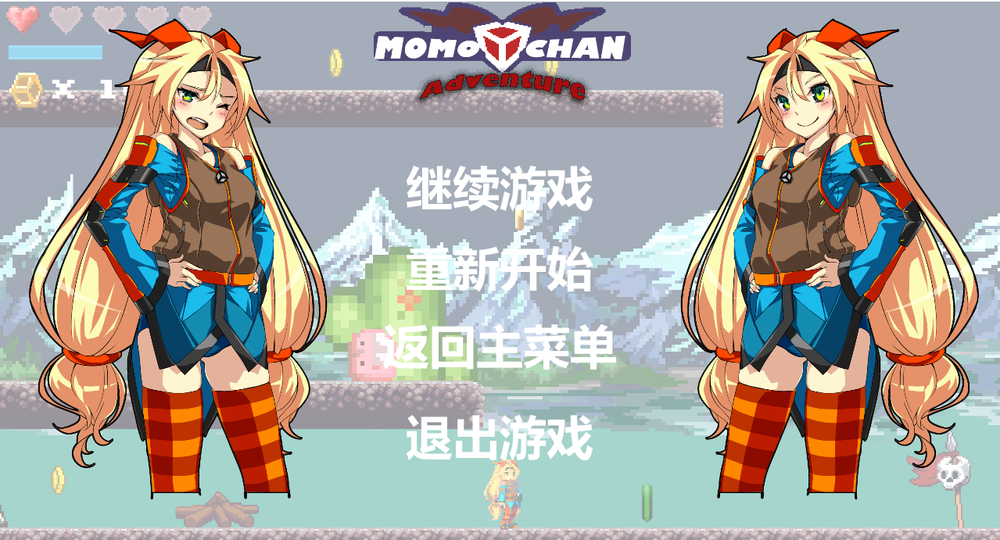
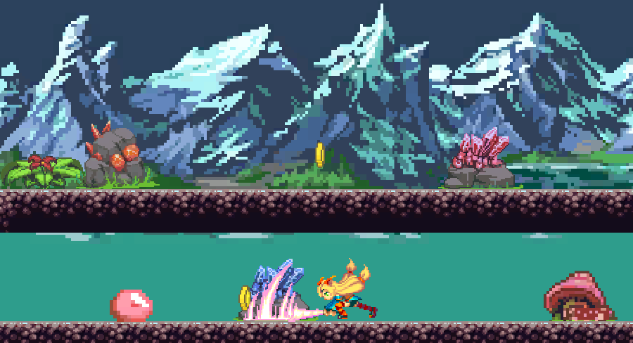

# MomoAdventure
基于Unity3D引擎开发的2D像素风格游戏。A pixel style 2D game developed with Untiy3D.

效果预览:

> 美术与音乐素材来源于网络。
素材链接：[unity-chan asset](http://unity-chan.com/contents/guideline_en/)
参考链接：[youtube](https://www.youtube.com/watch?v=iwC90hEpAMI&list=PL4czuZwtEBoyBRZi1_tmEe-yNmJSLT8li)